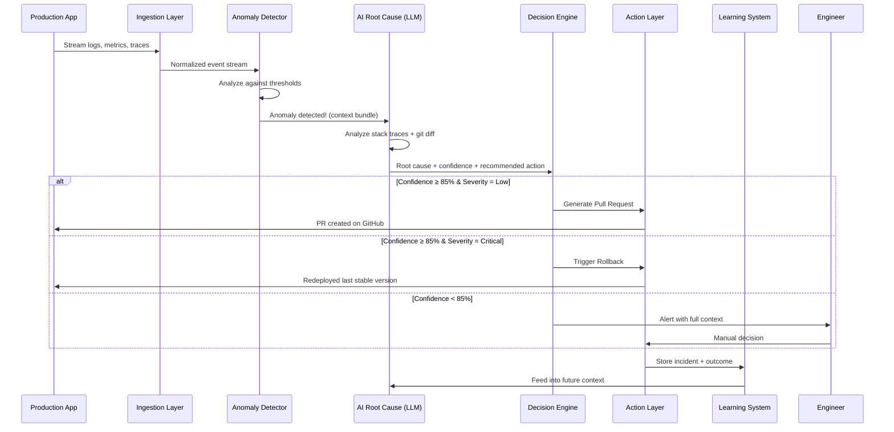
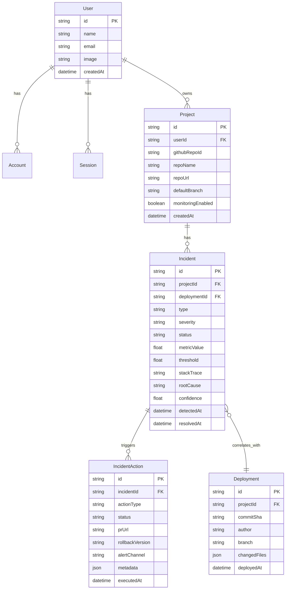

# AutoSRE AI — Architecture & Build Roadmap

> An AI-powered virtual Site Reliability Engineer that doesn't just detect problems — it understands and solves them.

---

## Table of Contents

1. [High-Level Architecture](#1-high-level-architecture)
2. [System Components Deep Dive](#2-system-components-deep-dive)
3. [Data Flow — End to End](#3-data-flow--end-to-end)
4. [Tech Stack](#4-tech-stack)
5. [Build Roadmap (Phased)](#5-build-roadmap-phased)
6. [Database Schema Design](#6-database-schema-design)
7. [API Design](#7-api-design)
8. [Safety & Guardrails](#8-safety--guardrails)
9. [Deployment Strategy](#9-deployment-strategy)
10. [Repository Structure](#10-repository-structure)

---

## 1. High-Level Architecture

```
┌─────────────────────────────────────────────────────────────────────────┐
│                        PRODUCTION ENVIRONMENT                          │
│   ┌──────────┐  ┌──────────┐  ┌───────────┐  ┌──────────────────┐     │
│   │ App Logs │  │ Metrics  │  │  Traces   │  │ Deployment Events│     │
│   └────┬─────┘  └────┬─────┘  └─────┬─────┘  └────────┬─────────┘     │
│        │              │              │                  │               │
└────────┼──────────────┼──────────────┼──────────────────┼───────────────┘
         │              │              │                  │
         ▼              ▼              ▼                  ▼
┌─────────────────────────────────────────────────────────────────────────┐
│                      INGESTION LAYER                                    │
│                                                                         │
│   Collects, normalizes, and streams data into the pipeline              │
│   ┌────────────────┐  ┌────────────────┐  ┌────────────────┐           │
│   │ Log Collector   │  │ Metric Scraper │  │ Webhook Listener│          │
│   │ (Fluentd/Vector)│  │ (Prometheus)   │  │ (GitHub/CI-CD) │          │
│   └───────┬────────┘  └───────┬────────┘  └───────┬────────┘           │
└───────────┼────────────────────┼────────────────────┼───────────────────┘
            │                    │                    │
            ▼                    ▼                    ▼
┌─────────────────────────────────────────────────────────────────────────┐
│                      ANOMALY DETECTION ENGINE                           │
│                                                                         │
│   Runs statistical models + threshold rules to flag anomalies           │
│   ┌───────────────────────────────────────────────────────────┐         │
│   │  • Error rate spike detection (e.g., 500s > 5% threshold) │         │
│   │  • Latency percentile monitoring (p95, p99)               │         │
│   │  • Resource saturation alerts (CPU > 85%, Memory > 90%)   │         │
│   │  • Deployment correlation (errors within 30min of deploy) │         │
│   └───────────────────────┬───────────────────────────────────┘         │
└───────────────────────────┼─────────────────────────────────────────────┘
                            │ Anomaly Detected!
                            ▼
┌─────────────────────────────────────────────────────────────────────────┐
│                  AI ROOT CAUSE ANALYSIS (LLM Core)                      │
│                                                                         │
│   Receives anomaly context, analyzes stack traces, correlates data      │
│   ┌───────────────────────────────────────────────────────────┐         │
│   │  Input:  Stack traces, error logs, recent git diffs,      │         │
│   │          deployment metadata, historical incidents        │         │
│   │                                                           │         │
│   │  Output: Root cause hypothesis + confidence score         │         │
│   │          e.g., "API auth middleware null pointer — 92%"    │         │
│   └───────────────────────┬───────────────────────────────────┘         │
└───────────────────────────┼─────────────────────────────────────────────┘
                            │
                            ▼
┌─────────────────────────────────────────────────────────────────────────┐
│                    DECISION ENGINE                                       │
│                                                                         │
│   Routes the action based on confidence, severity, and safety rules     │
│                                                                         │
│   ┌─────────────┐    ┌───────────────┐    ┌──────────────────┐         │
│   │ Confidence  │    │   Severity    │    │  Safety Rules    │         │
│   │   > 85%     │───▶│   Critical?   │───▶│  Passes checks?  │         │
│   └─────────────┘    └───────────────┘    └────────┬─────────┘         │
│                                                     │                   │
│              ┌──────────────┬───────────────────────┼───────┐           │
│              ▼              ▼                       ▼       ▼           │
│     ┌──────────────┐ ┌─────────────┐ ┌──────────────┐ ┌─────────┐     │
│     │ Generate PR  │ │  Rollback   │ │ Scale Infra  │ │  Alert  │     │
│     │  (Code Fix)  │ │ Deployment  │ │  Resources   │ │ Engineer│     │
│     └──────┬───────┘ └──────┬──────┘ └──────┬───────┘ └────┬────┘     │
└────────────┼────────────────┼───────────────┼──────────────┼───────────┘
             │                │               │              │
             ▼                ▼               ▼              ▼
┌─────────────────────────────────────────────────────────────────────────┐
│                      ACTION EXECUTION LAYER                             │
│                                                                         │
│   GitHub API │ CI/CD Pipeline │ Cloud Provider API │ Slack/PagerDuty    │
└─────────────────────────────────────────────────────────────────────────┘
             │
             ▼
┌─────────────────────────────────────────────────────────────────────────┐
│                   CONTINUOUS LEARNING SYSTEM                            │
│                                                                         │
│   Stores incident → root cause → action → outcome for future learning  │
│   Feeds back into the LLM context for improved accuracy over time       │
└─────────────────────────────────────────────────────────────────────────┘
```

---

## 2. System Components Deep Dive

### 2.1 Ingestion Layer
**Purpose:** Collect raw signals from the production environment and normalize them into a unified format.

| Source | Tool | What it Collects |
|---|---|---|
| Application Logs | Fluentd / Vector / CloudWatch Logs | Error messages, stack traces, request logs |
| System Metrics | Prometheus / CloudWatch Metrics | CPU, Memory, Disk, Network I/O |
| Traces | OpenTelemetry / Jaeger | Request flow across microservices |
| Deployment Events | GitHub Webhooks / CI-CD Webhooks | Commit SHA, deploy timestamp, author, changed files |

**Output:** A normalized event stream fed into a message queue (Redis Streams or Kafka) for real-time processing.

---

### 2.2 Anomaly Detection Engine
**Purpose:** Continuously analyze incoming data and flag when something deviates from normal behavior.

**Detection Methods:**
- **Threshold-based:** Static rules (e.g., error rate > 5% for 2 minutes).
- **Statistical:** Rolling averages and standard deviation (e.g., latency p99 is 3σ above the 24h average).
- **Deployment-correlated:** If errors spike within 30 minutes of a deployment, flag the deployment as the probable trigger.

**Output:** An `Anomaly Event` object containing:
```json
{
  "type": "error_rate_spike",
  "severity": "critical",
  "metric_value": 12.5,
  "threshold": 5.0,
  "started_at": "2026-04-25T09:12:00Z",
  "correlated_deployment": {
    "commit_sha": "a1b2c3d",
    "deployed_at": "2026-04-25T09:00:00Z",
    "author": "priyanshu",
    "changed_files": ["src/middleware/auth.ts"]
  }
}
```

---

### 2.3 AI Root Cause Analysis (The LLM Core)
**Purpose:** Take the anomaly context and determine *why* the problem is happening.

**How it works:**
1. Receives the `Anomaly Event` from the detection engine.
2. Enriches the context by fetching:
   - The actual stack traces from the error logs.
   - The `git diff` of the correlated deployment.
   - Similar past incidents from the knowledge base.
3. Sends a structured prompt to the LLM (e.g., OpenAI GPT-4 / Claude / Gemini):

```
You are an expert SRE. Analyze the following production incident:

**Anomaly:** Error rate spiked to 12.5% (threshold: 5%)
**Timeline:** Started 12 minutes after deployment a1b2c3d
**Stack Trace:** NullPointerException at AuthMiddleware.validate() line 47
**Git Diff:** [changed auth.ts — removed null check on token]
**Past Incidents:** [Similar issue on 2026-03-10, resolved by restoring null check]

Provide:
1. Root cause (one sentence)
2. Confidence score (0-100)
3. Recommended action (rollback / code_fix / alert_engineer)
4. If code_fix: provide the exact fix
```

**Output:**
```json
{
  "root_cause": "Null check removed from auth middleware token validation in commit a1b2c3d",
  "confidence": 94,
  "recommended_action": "code_fix",
  "fix": {
    "file": "src/middleware/auth.ts",
    "line": 47,
    "code": "if (!token) return res.status(401).json({ error: 'Unauthorized' });"
  }
}
```

---

### 2.4 Decision Engine
**Purpose:** Decide what action to take based on the LLM output and safety rules.

```
                    ┌─────────────────┐
                    │  LLM Output     │
                    │  confidence: 94 │
                    │  action: fix    │
                    └────────┬────────┘
                             │
                    ┌────────▼────────┐
                    │ Confidence ≥ 85?│
                    └──┬──────────┬───┘
                   YES │          │ NO
                       ▼          ▼
              ┌────────────┐  ┌──────────────────┐
              │ Severity?  │  │ Alert Engineers   │
              └──┬─────┬───┘  │ (Human-in-loop)  │
          CRIT   │     │ LOW  └──────────────────┘
                 ▼     ▼
        ┌──────────┐ ┌───────────────┐
        │ Rollback │ │ Generate PR   │
        │ NOW      │ │ (Auto or      │
        │          │ │  Supervised)  │
        └──────────┘ └───────────────┘
```

**Safety Rules (hardcoded, never overridden by AI):**
- Never auto-deploy a fix to production without tests passing.
- Always rollback if confidence < 70 and severity is critical.
- Never modify database migration files automatically.
- Always alert a human if the issue involves authentication or payment systems.

---

### 2.5 Action Execution Layer

| Action | How It Works |
|---|---|
| **Generate PR** | Uses GitHub API to create a branch, commit the fix, and open a Pull Request with an explanation and suggested tests. |
| **Rollback** | Calls the CI/CD pipeline API (GitHub Actions / ArgoCD) to redeploy the last known stable version. |
| **Scale Resources** | Calls cloud provider API (AWS/GCP) to increase replicas or bump instance sizes. |
| **Alert Engineer** | Sends a structured alert via Slack webhook or PagerDuty with the full incident context attached. |

---

### 2.6 Continuous Learning System
**Purpose:** Get smarter over time by learning from past incidents.

Every resolved incident is stored as a knowledge entry:
```json
{
  "incident_id": "INC-2026-0425",
  "anomaly_type": "error_rate_spike",
  "root_cause": "Missing null check in auth middleware",
  "action_taken": "code_fix",
  "outcome": "resolved",
  "resolution_time_seconds": 180,
  "feedback": "correct_fix"
}
```

This knowledge base is used as **context** for future LLM prompts, giving the AI memory of what worked before in this specific codebase.

---

## 3. Data Flow — End to End



---

## 4. Tech Stack

### Frontend (Dashboard)
| Layer | Technology | Why |
|---|---|---|
| Framework | **Next.js (App Router)** | Already in use, SSR + API routes |
| Styling | **Tailwind CSS** | Rapid UI development |
| Real-time | **WebSockets / Server-Sent Events** | Live incident feed on dashboard |
| Charts | **Recharts / Tremor** | Metric visualization |
| Auth | **NextAuth (GitHub OAuth)** | Already implemented |

### Backend (Core Engine)
| Layer | Technology | Why |
|---|---|---|
| Runtime | **Node.js (TypeScript)** | Consistent with frontend |
| API | **Express.js or Next.js API Routes** | REST + Webhook handlers |
| Queue | **Redis Streams or BullMQ** | Job queue for async processing |
| LLM | **OpenAI API / Anthropic API** | Root cause analysis |
| Database | **PostgreSQL (Prisma ORM)** | Already set up |

### Infrastructure & Integrations
| Layer | Technology | Why |
|---|---|---|
| Log Collection | **Fluentd / AWS CloudWatch** | Centralized log ingestion |
| Metrics | **Prometheus + Grafana** | Industry standard |
| CI/CD | **GitHub Actions** | PR automation + rollbacks |
| Alerts | **Slack API / PagerDuty** | Engineer notifications |
| Secrets | **AES-256-CBC Encryption** | Already built (`encrypt.ts`) |

---

## 5. Build Roadmap (Phased)

### Phase 1: Foundation (Weeks 1–3)
> Get the core infrastructure running — dashboard, database, and GitHub integration.

- [x] Set up Next.js project with TypeScript
- [x] Configure NextAuth with GitHub OAuth
- [x] Set up PostgreSQL with Prisma (User, Account, Session models)
- [x] Build encryption layer for sensitive tokens (`encrypt.ts`)
- [x] Import GitHub repositories (ImportRepo component)
- [ ] **Build the Dashboard UI**
  - Incident list view (table with status, severity, timestamp)
  - Incident detail page (stack trace, root cause, actions taken)
  - Project selector (linked to imported GitHub repos)
- [ ] **Expand Prisma schema** with:
  - `Project` model (linked to GitHub repos)
  - `Incident` model (anomaly events)
  - `IncidentAction` model (what action was taken)

---

### Phase 2: Ingestion & Detection (Weeks 4–6)
> Start collecting real data and detecting anomalies.

- [ ] **Build the Ingestion API**
  - `POST /api/ingest/logs` — Receive log entries
  - `POST /api/ingest/metrics` — Receive metric data points
  - `POST /api/webhooks/github` — Receive deployment events
- [ ] **Build the Anomaly Detection Engine**
  - Implement threshold-based rules (error rate, latency)
  - Implement deployment correlation logic
  - Store anomalies in the `Incident` table
- [ ] **Build a simple webhook receiver** for GitHub deployment events
- [ ] **Create a background worker** (BullMQ) to process the event queue

---

### Phase 3: AI Root Cause Analysis (Weeks 7–9)
> Integrate the LLM to analyze incidents and suggest root causes.

- [ ] **Build the LLM Analysis Service**
  - Create prompt templates for different anomaly types
  - Integrate with OpenAI/Anthropic API
  - Implement context enrichment (fetch git diffs via GitHub API)
- [ ] **Build the Decision Engine**
  - Implement confidence-based routing logic
  - Define and enforce safety rules
  - Route actions to the correct handler
- [ ] **Connect to the Dashboard**
  - Display AI-generated root cause on incident detail page
  - Show confidence score and recommended action

---

### Phase 4: Automated Actions (Weeks 10–12)
> Enable the system to take real actions — PRs, rollbacks, and alerts.

- [ ] **PR Generation Service**
  - Use GitHub API to create branches
  - Commit AI-generated code fixes
  - Open Pull Requests with explanations
- [ ] **Rollback Service**
  - Trigger GitHub Actions workflow for rollback
  - Implement Blue-Green / Canary rollback logic
- [ ] **Alert Service**
  - Integrate Slack webhook for engineer alerts
  - Include full incident context in alert payload
- [ ] **Validation Layer**
  - Run automated tests on generated fixes before PR
  - Static code analysis on AI-generated code

---

### Phase 5: Learning & Advanced Features (Weeks 13–16)
> Make the system smarter over time and add advanced capabilities.

- [ ] **Continuous Learning System**
  - Store resolved incidents with outcomes
  - Feed historical context into future LLM prompts
  - Track fix success rate per anomaly type
- [ ] **Cloud Misconfiguration Detection**
  - Scan AWS/GCP for open buckets, bad IAM policies
  - Suggest Infrastructure-as-Code fixes (Terraform)
- [ ] **Advanced Dashboard**
  - Incident timeline visualization
  - Mean Time to Resolution (MTTR) tracking
  - AI confidence accuracy over time
- [ ] **Multi-tenant support** (multiple teams/projects)

---

## 6. Database Schema Design



---

## 7. API Design

### Ingestion APIs
| Method | Endpoint | Description |
|---|---|---|
| `POST` | `/api/ingest/logs` | Receive application log entries |
| `POST` | `/api/ingest/metrics` | Receive metric data points |
| `POST` | `/api/webhooks/github` | Receive GitHub deployment/push events |

### Incident APIs
| Method | Endpoint | Description |
|---|---|---|
| `GET` | `/api/incidents` | List all incidents (with filters) |
| `GET` | `/api/incidents/:id` | Get incident detail + root cause + actions |
| `POST` | `/api/incidents/:id/analyze` | Trigger AI analysis on a specific incident |
| `POST` | `/api/incidents/:id/action` | Manually trigger an action (PR/rollback/alert) |

### Project APIs
| Method | Endpoint | Description |
|---|---|---|
| `GET` | `/api/projects` | List user's monitored projects |
| `POST` | `/api/projects` | Add a GitHub repo to monitoring |
| `PATCH` | `/api/projects/:id` | Toggle monitoring on/off |

### Dashboard APIs
| Method | Endpoint | Description |
|---|---|---|
| `GET` | `/api/dashboard/stats` | MTTR, incident count, fix success rate |
| `GET` | `/api/dashboard/timeline` | Incident timeline for visualization |

---

## 8. Safety & Guardrails

These rules are **hardcoded** and can **never be overridden by the AI**:

| Rule | Description |
|---|---|
| 🚫 No direct production deploys | AI-generated fixes go through PR → review → CI → merge. Never direct to prod. |
| 🧪 Tests must pass | A generated PR is only created if automated tests pass on the fix. |
| 🔒 Sensitive systems need humans | Any incident involving auth, payments, or database migrations always alerts an engineer. |
| ⏱️ Rollback timeout | If a fix doesn't resolve the incident within 10 minutes, auto-rollback triggers. |
| 📊 Confidence floor | No autonomous action is taken if confidence < 70%. Engineer is alerted instead. |
| 🔄 Rate limiting | Max 3 automated actions per incident to prevent infinite loops. |

---

## 9. Deployment Strategy

```
┌───────────────────────────────────────────────────┐
│               DEPLOYMENT ARCHITECTURE             │
│                                                   │
│  ┌─────────────┐     ┌─────────────────────────┐  │
│  │  Next.js    │     │   Background Workers    │  │
│  │  (Frontend  │     │   (BullMQ + Redis)      │  │
│  │   + API)    │     │                         │  │
│  │  Vercel /   │     │  • Anomaly Detector     │  │
│  │  Railway    │     │  • LLM Analysis Jobs    │  │
│  └──────┬──────┘     │  • Action Executors     │  │
│         │            │                         │  │
│         │            │  Railway / Fly.io /     │  │
│         │            │  AWS ECS               │  │
│         │            └────────────┬────────────┘  │
│         │                         │               │
│         ▼                         ▼               │
│  ┌─────────────────────────────────────────────┐  │
│  │          PostgreSQL (Supabase / Neon)        │  │
│  │          Redis (Upstash / Railway)           │  │
│  └─────────────────────────────────────────────┘  │
└───────────────────────────────────────────────────┘
```

| Component | Recommended Host | Why |
|---|---|---|
| Next.js App | **Vercel** or **Railway** | Zero-config deploys, edge functions |
| Background Workers | **Railway** or **Fly.io** | Long-running processes, auto-scaling |
| PostgreSQL | **Supabase** or **Neon** | Free tier, managed Postgres |
| Redis | **Upstash** | Serverless Redis, pay-per-request |
| LLM API | **OpenAI / Anthropic** | Best-in-class reasoning models |

---

## 10. Repository Structure

```
Recovera/
├── docs/                                  # All project documentation
│   ├── architecture-roadmap.md            # This file — system design & roadmap
│   └── client/
│       ├── database-schema.md             # Prisma schema explanation
│       ├── dashboard-logic.md             # Dashboard UI logic docs
│       └── encryption-logic.md            # encrypt.ts line-by-line explanation
│
├── client/                                # Next.js frontend + API routes
│   ├── app/
│   │   ├── layout.tsx                     # Root layout (fonts, providers)
│   │   ├── page.tsx                       # Landing page
│   │   ├── dashboard/
│   │   │   ├── page.tsx                   # Main dashboard (incident list)
│   │   │   └── [incidentId]/
│   │   │       └── page.tsx               # Incident detail page
│   │   └── api/
│   │       ├── auth/
│   │       │   └── [...nextauth]/
│   │       │       └── route.ts           # NextAuth config (GitHub OAuth)
│   │       ├── ingest/
│   │       │   ├── logs/
│   │       │   │   └── route.ts           # POST — receive application logs
│   │       │   └── metrics/
│   │       │       └── route.ts           # POST — receive metric data points
│   │       ├── webhooks/
│   │       │   └── github/
│   │       │       └── route.ts           # POST — GitHub deployment events
│   │       ├── incidents/
│   │       │   ├── route.ts               # GET all / POST create incident
│   │       │   └── [id]/
│   │       │       ├── route.ts           # GET detail / PATCH update
│   │       │       ├── analyze/
│   │       │       │   └── route.ts       # POST — trigger AI analysis
│   │       │       └── action/
│   │       │           └── route.ts       # POST — trigger PR/rollback/alert
│   │       ├── projects/
│   │       │   ├── route.ts               # GET all / POST add repo
│   │       │   └── [id]/
│   │       │       └── route.ts           # PATCH toggle monitoring
│   │       └── dashboard/
│   │           ├── stats/
│   │           │   └── route.ts           # GET — MTTR, fix rate, counts
│   │           └── timeline/
│   │               └── route.ts           # GET — incident timeline data
│   │
│   ├── components/
│   │   ├── ImportRepo.tsx                 # GitHub repo import UI
│   │   ├── IncidentCard.tsx               # Single incident in the list
│   │   ├── IncidentDetail.tsx             # Full incident view + root cause
│   │   ├── StatsCard.tsx                  # Dashboard metric card
│   │   ├── TimelineChart.tsx              # Incident timeline visualization
│   │   ├── ActionButton.tsx               # Trigger PR / Rollback / Alert
│   │   └── Navbar.tsx                     # Navigation bar
│   │
│   ├── lib/
│   │   ├── prisma.ts                      # Prisma client singleton
│   │   ├── encrypt.ts                     # AES-256-CBC encrypt/decrypt
│   │   ├── github.ts                      # GitHub API helpers (repos, diffs)
│   │   └── llm.ts                         # LLM API client (prompt builder)
│   │
│   ├── prisma/
│   │   ├── schema.prisma                  # Database schema (all models)
│   │   └── migrations/                    # Auto-generated migration files
│   │
│   ├── generated/
│   │   └── prisma/                        # Auto-generated Prisma client
│   │
│   ├── server/
│   │   └── server.ts                      # Standalone server entry (if needed)
│   │
│   ├── public/                            # Static assets (images, icons)
│   ├── .env                               # Environment variables (secrets)
│   ├── package.json
│   ├── tsconfig.json
│   └── next.config.ts
│
├── workers/                               # Background processing (Phase 2+)
│   ├── anomaly-detector.ts                # Threshold & statistical analysis
│   ├── llm-analyzer.ts                    # LLM root cause analysis jobs
│   ├── action-executor.ts                 # PR generation, rollback, alerts
│   └── queue.ts                           # BullMQ / Redis queue config
│
├── .gitignore
└── README.md
```

### Folder Responsibilities

| Folder | Responsibility |
|---|---|
| `docs/` | All human-readable documentation — architecture, schema explanations, logic breakdowns |
| `client/app/` | Next.js pages and API routes — the entire frontend and backend API surface |
| `client/app/api/ingest/` | Endpoints that receive raw data from production (logs, metrics) |
| `client/app/api/webhooks/` | Endpoints that receive events from external services (GitHub, CI/CD) |
| `client/app/api/incidents/` | CRUD + AI analysis + action triggers for incidents |
| `client/components/` | Reusable React UI components for the dashboard |
| `client/lib/` | Shared utility functions — database, encryption, GitHub API, LLM client |
| `client/prisma/` | Database schema definition and migration history |
| `workers/` | Long-running background jobs — anomaly detection, LLM analysis, and automated actions |
